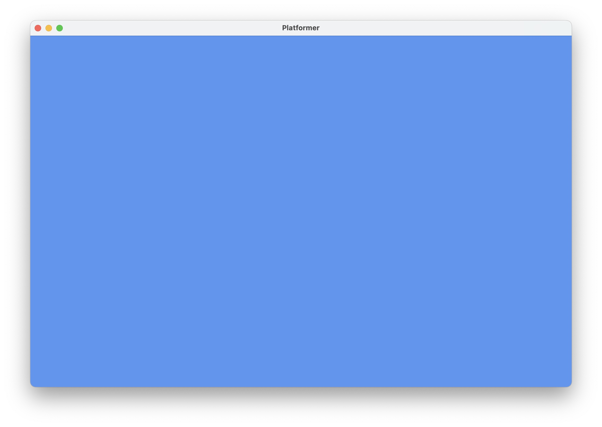

From [Arcade Academy - Platform Tutorial - Step 1](https://api.arcade.academy/en/latest/examples/platform_tutorial/step_01.html#step-1-install-and-open-a-window)

# Open a Window

The example below opens up a blank window. Set up a project and get the code below working. (It is also in the zip file as 01_open_window.py.)

> This is a fixed-size window. It is possible to have a [Resizable Window](https://api.arcade.academy/en/latest/examples/resizable_window.html#resizable-window) or a [Full Screen Example](https://api.arcade.academy/en/latest/examples/full_screen_example.html#full-screen-example), but there are more interesting things we can do first. Therefore we’ll stick with a fixed-size window for this tutorial.

```python
"""
Platformer Game
"""
import arcade

# Constants
SCREEN_WIDTH = 1000
SCREEN_HEIGHT = 650
SCREEN_TITLE = "Platformer"


class MyGame(arcade.Window):
    """
    Main application class.
    """

    def __init__(self):

        # Call the parent class and set up the window
        super().__init__(SCREEN_WIDTH, SCREEN_HEIGHT, SCREEN_TITLE)

        arcade.set_background_color(arcade.csscolor.CORNFLOWER_BLUE)

    def setup(self):
        """Set up the game here. Call this function to restart the game."""
        pass

    def on_draw(self):
        """Render the screen."""

        self.clear()
        # Code to draw the screen goes here


def main():
    """Main function"""
    window = MyGame()
    window.setup()
    arcade.run()


if __name__ == "__main__":
    main()

``` 
You should end up with a window like this:



Once you get the code working, figure out how to adjust the code so you can:

* Change the screen size

* Change the title

* Change the background color

	- See the documentation for [arcade.color package](https://api.arcade.academy/en/latest/arcade.color.html#color)

	- See the documentation for [arcade.csscolor package](https://api.arcade.academy/en/latest/arcade.csscolor.html#csscolor)

* Look through the documentation for the [arcade.Window](https://api.arcade.academy/en/latest/api/window.html#arcade.Window) class to get an idea of everything it can do.

From [Arcade Academy - Platform Tutorial - Step 1](https://api.arcade.academy/en/latest/examples/platform_tutorial/step_01.html#step-1-install-and-open-a-window)

# Open a Window

The example below opens up a blank window. Set up a project and get the code below working. (It is also in the zip file as 01_open_window.py.)

> This is a fixed-size window. It is possible to have a [Resizable Window](https://api.arcade.academy/en/latest/examples/resizable_window.html#resizable-window) or a [Full Screen Example](https://api.arcade.academy/en/latest/examples/full_screen_example.html#full-screen-example), but there are more interesting things we can do first. Therefore we’ll stick with a fixed-size window for this tutorial.

`01_open_window.py`

```python
"""
Platformer Game
"""
import arcade

# Constants
SCREEN_WIDTH = 1000
SCREEN_HEIGHT = 650
SCREEN_TITLE = "Platformer"


class MyGame(arcade.Window):
    """
    Main application class.
    """

    def __init__(self):

        # Call the parent class and set up the window
        super().__init__(SCREEN_WIDTH, SCREEN_HEIGHT, SCREEN_TITLE)

        arcade.set_background_color(arcade.csscolor.CORNFLOWER_BLUE)

    def setup(self):
        """Set up the game here. Call this function to restart the game."""
        pass

    def on_draw(self):
        """Render the screen."""

        self.clear()
        # Code to draw the screen goes here


def main():
    """Main function"""
    window = MyGame()
    window.setup()
    arcade.run()


if __name__ == "__main__":
    main()

``` 
You should end up with a window like this:


Once you get the code working, figure out how to adjust the code so you can:

* Change the screen size

* Change the title

* Change the background color

	- See the documentation for [arcade.color package](https://api.arcade.academy/en/latest/arcade.color.html#color)

	- See the documentation for [arcade.csscolor package](https://api.arcade.academy/en/latest/arcade.csscolor.html#csscolor)

* Look through the documentation for the [arcade.Window](https://api.arcade.academy/en/latest/api/window.html#arcade.Window) class to get an idea of everything it can do.
